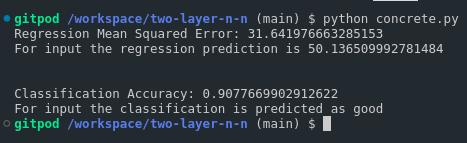

## How to run

- ``` pip install -r requirements.txt ```
- ``` python concrete.py ```

## Specification

- This code has two layer with 50 neurons each and iterates 1000 times to find the regression mean squared error and classification accuracy in case of regression and classification respectively.

- It also outputs regression prediction and class in case of regression and classification problem respectively.

Note : Code takes time to run, therefore added the screenshot of output

## Screenshot


