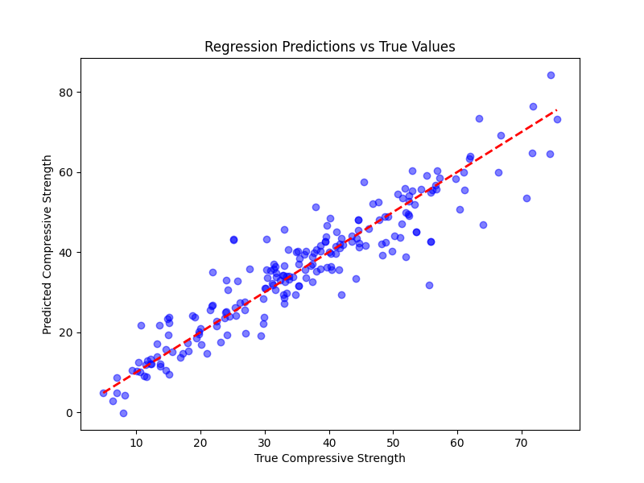
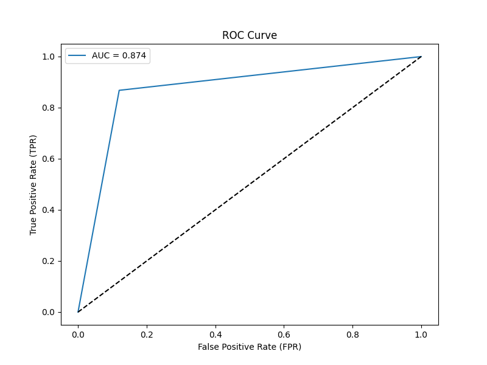
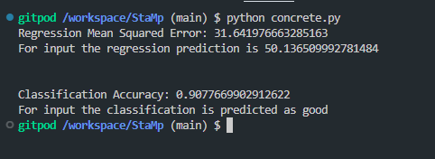

## How to run

- ``` pip install -r requirements.txt ```
- ``` python concrete.py ```

## Specification

- This code has one hidden layer with 50 neurons and iterates 1000 times to find the regression mean squared error and classification accuracy in case of regression and classification respectively.

- It also outputs regression prediction and class in case of regression and classification problem respectively.

- It also outputs the ROC curve for classification problem.

- It also outputs the scatter plot for regression problem.

**Note : Code takes time to run, therefore added the screenshot of output and plots**


## Scatter Plot for regression



## ROC Curve for classification



## Screenshot of output

