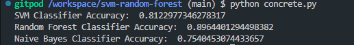

## How to run

- ``` pip install -r requirements.txt ```
- ``` python concrete.py ```

## Specification

- This code includes the classification using random forest and svm for the concrete dataset.

- This code includes the ROC curve for the random forest classifier, feature importance for the random forest classifier, and the decision boundary for the svm classifier.

## Plots

### Random Forest ROC Curve


### Random Forest Feature Importance


### SVM Decision Boundary


## Screenshot of output

